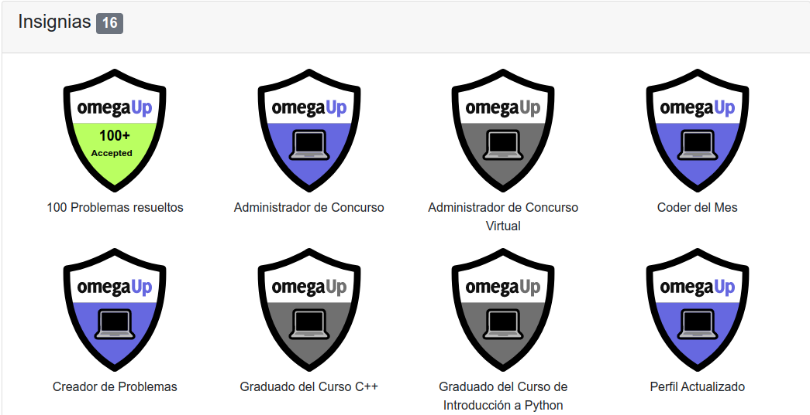
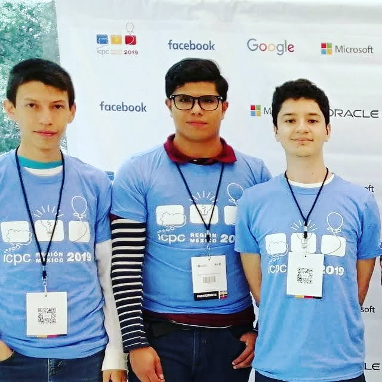

# history-cp
:computer:
My - competitive programming - history

I love a lot the problem solving, learn about data structures and algorithms. I had a first interest in competitive programming just before the university (2016). In 2017 I started to practice with problems in HackerRank and OmegaUp, then in 2018 I was beginner participant at competitive programming contests (official contests like ACM-ICPC and CodeJam). In this repository also I have technical interview practice exercises.

<strong>The online judge that I've use are (links to my profiles, only 1-7 items):</strong>

1. [OmegaUp](https://omegaup.com/profile/davbetm/)
2. [HackerRank](https://www.hackerrank.com/davbetm)
3. [CodeForces](https://codeforces.com/profile/dbetm)
4. [GeeksForGeeks](https://auth.geeksforgeeks.org/user/davidbetancourtmontellano/profile)
5. [URI](https://www.urionlinejudge.com.br/judge/es/profile/301236)
6. [CodeSignal](https://app.codesignal.com/profile/dbetm)
7. [MOG](https://matcomgrader.com/user/17187/)

8. [A2 Online Judge - main page](https://a2oj.com)
9. [SPOJ - submissions](https://www.spoj.com/)
10. [COJ - main page](http://coj.uci.cu/index.xhtml)
11. [UVa - main page](https://uva.onlinejudge.org/)

<h5>Achievments:</h5>

1. July 2019. [I was the coder of the month in OmegaUp](https://omegaup.com/coderofthemonth/)

2. November 2019. With my competitive programming team we classify for the regional final for [ACM-ICPC MX](https://icpc.global/), which is a national knockout. [A related article.](https://tec.mx/es/noticias/nacional/investigacion/congregan-en-el-tec-los-mejores-equipos-de-programadores-en-mexico)

